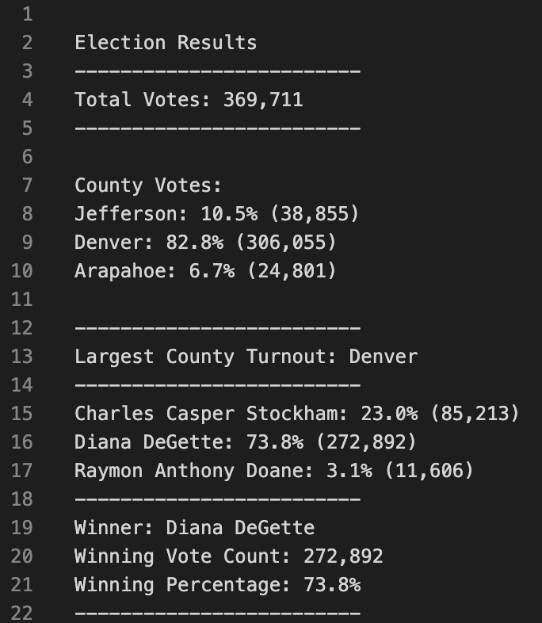

# Election_Analysis

### Module 3 Challenge introduction. 
With eleciton dataset, this analysis will provide insights on votes by counties, votes by candidates, winner county, as well as who the final winner is!  

---
#### [Overview of Election Audit]
##### <i>Explain the purpose of this election audit analysis:</i> 

The purpose of this analysis is to perform a fast and intellectual program that audits through the election votes dataset. Data analysis will provide relative summarizations of election results. Summaries include total votes, number of votes by counties,  largest county turnout, votes by candidates, and most importantly: 

<u><b>THE WINNER</b></u> of this election!!!

#### [Election-Audit Results] 
##### <i>Using a bulleted list, address the following election outcomes. Use images or examples of your code as support where necessary: </i>
* How many votes were cast in this congressional election?
  * Total votes count: <u>369,711</u>
* Provide a breakdown of the numbers of votes and the percentage of total votes for each county in the precint.
  * Jefferson county: <u>10.5%</u> - total: <u>38,855</u> votes
  * Denver county: <u>82.8%</u> - total: <u>306,055</u> votes
  * Arapahoe county: <u>6.7%</u> - total: <u>24,801</u> votes
* Which county had the largest number of votes?
  * Largest County Turnout: <u>Denver</u>
* Provide a breakdown of the number of votes and the percentage of the total votes each candidate received.
  * Charles Casper Stockham: <u>23.0%</u> (<u>85,213</u> votes)
  * Diana DeGette: <u>73.8%</u> (<u>272,892</u> votes)
  * Raymon Anthony Doane: <u>3.1%</u> (<u>11,606</u> votes)
* Which candidate won the election, what was their vote count, and what was their percentage of the total votes?
  * Winner: <u>Diana DeGette</u>
  * Winning Vote Count: <u> 272,892 </u>
  * Winning Percentage: <u>73.8%</u> 

 

#### [Election-Audit Summary]
##### <i>In a summary statement, provide a business proposal to the election commission on how this script can be used—with some modifications—for any election. Give at least two examples of how this script can be modified to be used for other elections.<i> 

In the event where election contains larger number of votes, the script is capable of capturing all votings, as long as the data contains no entry error. Script can also collect newly added candidates, and counties if they are existing in the dataset. This analysis script can be widely used in a diversity of areas, not strictly in voting. Script can run on datasets that can provide potential insights for local business strategy purposes. For instance,  dataset containing information on items sold from a local American multinational consumer electronics retailer store, script can perform summarizations of best selling product, breakdown of number of items sold and their percentages, relatively.

<u>Code:</u>

		# -*- coding: UTF-8 -*-
	"""PyPoll Homework Challenge Solution."""
	
	# Add our dependencies.
	import csv
	import os
	
	# Add a variable to load a file from a path.
	file_to_load = os.path.join("Resources", "election_results.csv")
	# Add a variable to save the file to a path.
	file_to_save = os.path.join("analysis", "election_analysis.txt")
	
	# Initialize a total vote counter.
	total_votes = 0
	
	# Candidate Options and candidate votes.
	candidate_options = []
	candidate_votes = {}
	
	# 1: Create a county list and county votes dictionary.
	county_names = []
	county_votes = {}
	
	
	# Track the winning candidate, vote count and percentage
	winning_candidate = ""
	winning_count = 0
	winning_percentage = 0
	
	# 2: Track the largest county and county voter turnout.
	winning_county = ""
	winning_county_count = 0
	
	
	# Read the csv and convert it into a list of dictionaries
	with open(file_to_load) as election_data:
	    reader = csv.reader(election_data)
	
	    # Read the header
	    header = next(reader)
	
	    # For each row in the CSV file.
	    for row in reader:
	
	        # Add to the total vote count
	        total_votes = total_votes + 1
	
	        # Get the candidate name from each row.
	        candidate_name = row[2]
	
	        # 3: Extract the county name from each row.
	        county = row[1]
	
	        # If the candidate does not match any existing candidate add it to
	        # the candidate list
	        if candidate_name not in candidate_options:
	
	            # Add the candidate name to the candidate list.
	            candidate_options.append(candidate_name)
	
	            # And begin tracking that candidate's voter count.
	            candidate_votes[candidate_name] = 0
	
	        # Add a vote to that candidate's count
	        candidate_votes[candidate_name] += 1
	
	        # 4a: Write an if statement that checks that the
	        # county does not match any existing county in the county list.
	        if county not in county_names:
	
	            # 4b: Add the existing county to the list of counties.
	            county_names.append(county)
	
	            # 4c: Begin tracking the county's vote count.
	            county_votes[county] = 0
	
	        # 5: Add a vote to that county's vote count.
	        county_votes[county] += 1
	
	
	# Save the results to our text file.
	with open(file_to_save, "w") as txt_file:
	
	    # Print the final vote count (to terminal)
	    election_results = (
	        f"\nElection Results\n"
	        f"-------------------------\n"
	        f"Total Votes: {total_votes:,}\n"
	        f"------------------------- \n\n"
	        f"County Votes:\n")
	    print(election_results)
	
	    txt_file.write(election_results)
	
	    # 6a: Write a for loop to get the county from the county dictionary.    
	    for county in county_votes:
	        # 6b: Retrieve the county vote count.
	        count = county_votes.get(county)
	        
	        # 6c: Calculate the percentage of votes for the county.
	        county_vote_percentage = count / total_votes * 100
	
	        # 6d: Print the county results to the terminal.
	        county_results = (
	            f"{county}: {county_vote_percentage:.1f}% ({count:,})\n")
	        print(county_results)
	
	        # 6e: Save the county votes to a text file.
	        txt_file.write(county_results)
	
	        # 6f: Write an if statement to determine the winning county and get its vote count.
	        if (count > winning_county_count):
	            winning_county_count = count
	            winning_county = county
	    
	
	    # 7: Print the county with the largest turnout to the terminal.
	    winning_county_summary = (
	        f"\n-------------------------\n"
	        f"Largest County Turnout: {winning_county}\n"
	        f"-------------------------\n")        
	    print(winning_county_summary)
	
	    # 8: Save the county with the largest turnout to a text file.
	    txt_file.write(winning_county_summary)
	
	    # Save the final candidate vote count to the text file.
	    for candidate_name in candidate_votes:
	
	        # Retrieve vote count and percentage
	        votes = candidate_votes.get(candidate_name)
	        vote_percentage = float(votes) / float(total_votes) * 100
	        candidate_results = (
	            f"{candidate_name}: {vote_percentage:.1f}% ({votes:,})\n")
	
	        # Print each candidate's voter count and percentage to the
	        # terminal.
	        print(candidate_results)
	        #  Save the candidate results to our text file.
	        txt_file.write(candidate_results)
	
	        # Determine winning vote count, winning percentage, and candidate.
	        if (votes > winning_count) and (vote_percentage > winning_percentage):
	            winning_count = votes
	            winning_candidate = candidate_name
	            winning_percentage = vote_percentage
	
	    # Print the winning candidate (to terminal)
	    winning_candidate_summary = (
	        f"-------------------------\n"
	        f"Winner: {winning_candidate}\n"
	        f"Winning Vote Count: {winning_count:,}\n"
	        f"Winning Percentage: {winning_percentage:.1f}%\n"
	        f"-------------------------\n")
	    print(winning_candidate_summary, "\n")
	
	    # Save the winning candidate's name to the text file
	    txt_file.write(winning_candidate_summary)
